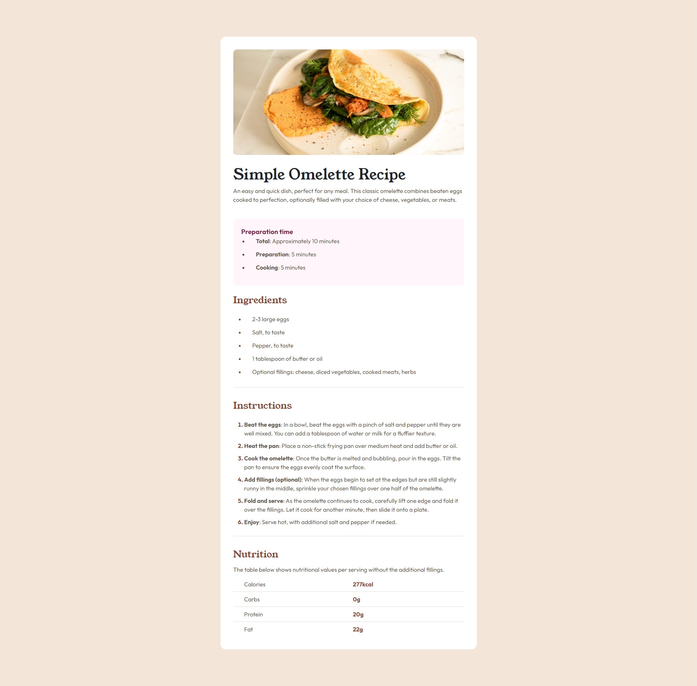

# Recipe page solution

This is a solution to the "Recipe page challenge on Frontend Mentor" - https://www.frontendmentor.io/challenges/recipe-page-KiTsR8QQKm. 

## Table of contents


- [Screenshot](#screenshot)
- [Links](#links)
- [Built with](#built-with)
- [What I learned](#what-i-learned)
- [Continued development](#continued-development)
- [Useful resources](#useful-resources)
- [Author](#author)

### Screenshot



### Links

- Live Site URL: https://danieldeaconescu.github.io/recipe-page/

### Built with

- Semantic HTML5 markup
- CSS custom properties
- Flexbox
- Bootstrap

### What I learned

This project gave me the opportunity to remember the Bootstrap fundamentals. 

It was also a great practice of basic HTML and CSS. 

To see how you can add code snippets, see below:

```html
<div class="recipe-nutrition-table container-fluid">
          <div class="calories-line row">
            <div class="text col-6 pb-2">Calories</div>
            <div class="value col-6 pb-2">277kcal</div>
            <div class="horizontal-rule"></div>
          </div>

          <div class="carbs-line row">
            <div class="text col-6 pb-2 pt-2">Carbs</div>
            <div class="value col-6 pb-2 pt-2">0g</div>
            <div class="horizontal-rule"></div>
          </div>
          <div class="protein-line row">
            <div class="text col-6 pb-2 pt-2">Protein</div>
            <div class="value col-6 pb-2 pt-2">20g</div>
            <div class="horizontal-rule"></div>
          </div>
          <div class="fat-line row">
            <div class="text col-6 pb-2 pt-2">Fat</div>
            <div class="value col-6 pb-2 pt-2">22g</div>
          </div>
        </div>
```

### Continued development

I would like to center the main within the body because right now it only has equal margin-top and margin-bottom values. 


### Useful resources

- [Bootstrap](https://getbootstrap.com/) - This helped me download the Bootstrap files. 
- [Google Fonts](https://fonts.google.com/)

## Author

- Frontend Mentor - https://www.frontendmentor.io/profile/DanielDeaconescu
